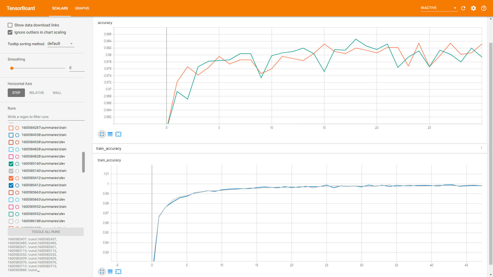
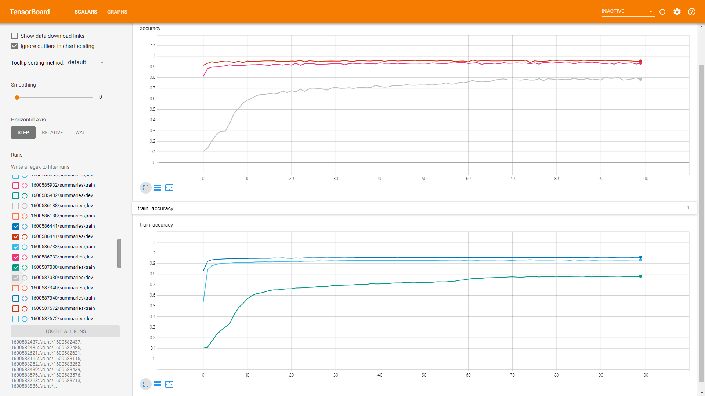

# README.md

고려대학교 컴퓨터학과 2020년 2학기 DeepLeaning 과제 2

Tensorflow를 이용한 MNIST 신경망 학습

2015410115 송재민

**9월 20일 18시 7분경에 딥러닝 오픈채팅방에서 Validation Set 비교 과정에서 Dropout 확률이 0.0인것을 확인한 후 모델을 다시 학습시킨 결과이므로, 기존에 기준삼아 썼던 모델의 결과값이 달라져 보고서가 조금 이상해졌습니다. 죄송합니다.** 엑셀 파일의 시트가 구분되어 있는데, Table(failed) 는 기존의 Dropout확률을 바꾸지 않은 결과입니다. 결론적으로 Table시트만 확인하시면 됩니다.

### 파일 설명

- `MNIST_train.py` 모델 선언과 Train set & Validation set을 이용해 모델을 Training 하는 파일
- `MNIST_eval.py` 만들어진 모델에 Test set을 이용해 성능을 평가하는 파일
- `tensorboard_run.py` 만들어진 모델들을 Tensorboard로 한꺼번에 시각화하는 파일
- `hyperparameters.py` 모델의 하이퍼파라미터를 쉽게 설정하기 위한 파일
- `./INFOS` 학습 및 테스트 결과가 .txt로 저장되는 디렉토리
- `./for_report` 레포트 작성 위한 파일들이 존재. 엑셀 파일 원본도 이곳에 있습니다.

  `./MNIST_data`에 학습에 필요한 MNIST데이터들이 다운로드 되며, `./runs`에 모델들이 저장된다.

  `MNIST_train.py` 코드의 첫 줄에 `presets = []` 리스트에 실행하고 싶은 프리셋 번호를 넣으면, 해당 프리셋들이 훈련되어 `./runs`에 모델이 저장된다. 훈련 중의 로그는 `./INFOS/training_log.txt` 파일에 기록되며, 모든 훈련이 끝난 후 성능은 `./INFOS/overral_info.txt`에 기록된다.

  훈련 후 테스트셋으로 정확도를 평가하기 위해서 `MNIST_eval.py`를 실행시키면 된다. 자동으로 `./runs`에 있는 폴더들을 읽어, 모든 정확도를 `./INFOS/eval_log.txt`에 기록한다.

  `tensorboard_run.py`는 `./runs`에 있는 모든 모델들을 한꺼번에 텐서보드로 실행한다. `localhost:6006`으로 접속하면 결과를 볼 수 있다.

### 목표 (10점 만점)

- **구현 간결성 정확성** (6점)
    - 4 layers 이상 구현 (Hidden layers 기준 3층) : 4점
    - Dropout 구현: 1점
    - Weight initialization 구현: 1점
    - Weight decay 구현: 1점
- **성능** (2점)
    - Test accuracy 기준 97.5% 이상 달성: 2점
- **결과 분석의 명확성** (2점)

### 결과

- [MNIST Evaluation Report (2015410115 SongJaemin)](https://docs.google.com/spreadsheets/d/1XAw-ErOm_aOnP0-l_56ED3EOSCTwPXNKKRQhuXckrtQ/edit?usp=sharing) 

(Google Spreadsheet 링크)

### 모델 그래프

### 하이퍼파라미터 튜닝 과정

  9번 ~ 13번을 통해서 히든 레이어의 깊이를 바꿔가며 Test accuracy를 측정해 보았는데, 레이어 수가 늘어난다고 성능이 급격히 좋아지지는 않았다. 오히려 미세하게 떨어지는 경우가 대부분이었다. 데이터를 설명하는 층위가 늘어나면 늘어날수록, 트레이닝 셋에 과적합될 위험성이 높아지는 것 같다. 트레이닝 셋에 대해 구구절절 너무 많이 따지게 되어, 오히려 새로운 테스트 셋에 취약해 진다고 보면 될 것 같다. 무엇보다 레이어 수가 늘어나면 학습에 소요되는 시간이 늘어나 불편했다.

  원래라면 9번 ~ 13번 중에서 과제의 요건을 충족하면서 (4레이어 이상) 테스트 셋에 대해서 가장 높은 정확도를 보이는 10번을 바탕으로 하이퍼파라미터를 튜닝해 나가는 것이 맞겠지만 과제에서 제시된 최대 레이어보다 한 단계 더 높은 모델을 만들어 보고 싶어서 11번 모델을 바탕으로 튜닝해 나가 보기로 했다.

*Weight Initialization(14 - 1600585160, 15 - 1600585412)*

  그 다음 바꿔본 요소는 가중치 초기화 방법이다. 14번과 15번이 그 결과인데, 14번인 HE가 더 좋은 성능을 보였다. 14번을 바탕으로 다시 튜닝해 나가기로 했다.

*Weight Decay (16 - 1600585663, 17 - 1600586188, 18 - 1600586441)*

  16부터 18에서는 Weight Decay를 추가해 주었다. 0.1부터 0.001까지 줄여 나가는 방법을 택해 보았는데, 0.1의 경우 눈에 띄게 정확도가 낮았다. 가중치의 L2 Norm합이 Cost에 너무 크게 반영되어, 역전파가 제대로 일어나지 않는 것 같았다. 17번(0.01)과 18번(0.001) 중 더 높은 성능을 보이는 18번을 택하기로 했다.

*Dropout (19 - 1600586441, 20 - 1600586733, 21 - 1600587030)*

  그 다음은 Dropout을 튜닝했다. 19번 ~ 21번이 그 결과인데, 여기서 Dropout의 값은 `tf.nn.dropout`함수의 `rate`파라미터를 통해 전달되며, 뉴런이 제거될 확률이다. (`keep_prob`과 정 반대이다.) Dropout 확률을 0.2로 주었을때의(19번) 성능이 가장 높게 나왔다.

  Dropout까지 튜닝하고 나서 95%정도의 정확도를 얻었지만 목표치에는 많이 못 미쳤다. 따라서 100이었던 배치 사이즈를 200으로 바꾸어 조금 더 데이터를 일반화해서 받아보려고 시도했다. 이전 단계에서 가장 높은 정확도를 보였던 19번을 기준으로 배치 사이즈를 200으로 바꾼 것이 22번인데, 바꾸자 마자 96%로 정확도가 상승했다.

  배치 사이즈를 바꾼 후 다시 Dropout확률을 수정해 보았는데 (22번 ~ 25번), 0.2 근방에서 0.5씩 텀을 두어 조금씩 바꿔보았지만 0.2가 최적이었다. (22번) (Validation Set에서 Dropout 확률을 0.0으로 하지 않았을 때의 결과입니다. 0.0으로 한 후에는 Dropout rate 가 0.15일때 최적의 성능을 보입니다.)

  그 다음 26번에서 Optimizer도 바꾸어 보았지만 오히려 극적으로 정확도가 낮아졌다. 실수로 Dropout 확률을 고정시키지 못했지만 (25번의 Dropout Rate가 0.2가 아닌 0.3이다.) 정확도가 10%대 였기 때문에 별로 의미는 없는 것 같았다. 아무래도 손글씨 인식에서 adadelta optimizer는 맞지 않는 것 같다.

  27번부터 31번까지 Weight Decay를 10의 배수 단위로 바꾸어 보았는데, 0.0001에서 최적의 성능을 보였다. 솔직히 너무 작은 값이어서 가중치 매트릭스들의 L2 Norm합이 너무 적게 반영이 된 것이 아닌가 했지만, <u>어쨌든 목표치인 97.5% 이상에 도달하긴 하였다. (31번)</u>

*Learning Rate (32 - 1600589603, 33 - 1600589819, 34 - 1600590029, 35 -1600590243)*

  과제의 요건에는 도달했지만 98을 넘어보고 싶어서 바꾸어 보지 않았던 Learning Rate를 건드려 본 것이 32번부터 35번이다. 0.01, 0.1, 1, 0.001을 시도해 보았지만 바꾸지 않은 값인 0.001이 가장 정확도가 높았다. (31번) 그 다음으로는 Learning Rate가 0.0001일때(35번)가 높았다. 작을수록 정확해지는 것 같기는 하다.

  36과 37은 자존심을 버리고 레이어 변경에서 가장 높은 정확도를 보였던 레이어 사이즈 4로 바꾸어 보았는데, Dropout등을 추가한 상태여서 그런지 정확도가 크게 상승하지는 않았다. 혹시 몰라서 Weight Decay 값도 바꾸어 보았지만(37번) 정확도는 오히려 줄어들었다.

## 개선할 점

  더 많은 모델들로 실험을 해보았지만, 아쉬운 점이 많다. 이 과제에 2000분 정도를 투자하여 현재 매우 지친 상태이고, 제출 시간이 임박하여 더 많은 실험을 해보지 못한 것이 아쉽다. 또한 Validation Set의 Dropout Rate를 0.0으로 설정하지 않은 상태에서 과제의 대부분을 진행했고, 마지막에 허겁지겁 0.0으로 설정하여 다시 학습시켰기 때문에 파라미터 튜닝 과정이 엉망이 되었다.

  파라미터의 값을 바꿀 때마다 성능이 달라지는것을 보고 어떤 파라미터가 가장 큰 영향을 끼치는지 파악할 수 있었다. 교수님이 레이어의 깊이와 Learning Rate가 정확도에 가장 큰 영향을 미친다고 하셨는데, 그 두개를 최우선적으로 적용하여 진행하지 못한 것은 명백히 실수이다. 그 실수를 파악했을 때 쯤 이미 30개 정도의 모델을 만들어가고 있었기 때문에, 바꾸기가 너무 어려웠다.

  아직 파라미터의 수치를 바꾸는 것의 의미가 무엇인지 확실하게 와닿지 않는 것 같다. 예를 들어, 레이어 사이즈를 늘리는 것은 입력 데이터에 대해 모델이 내부적으로 더 많은 차원으로 설명한다고 이해했는데, 나의 이해가 맞는지 확실하지 않다. 또한 어째서 Dropout확률 0.2에서 Weight Decay값 0.0001에서 최적의 성능이 나오는지, 왜 가중치 초기화시 XE가 아닌 HE를 사용해야 하는지 설명하기가 힘든 것 같다. 특히 Weight Decay의 경우 0.0001이면 가중치 매트릭스의 L2 Norm의 누적합이 거의 반영되지 않은 것 같다고 느껴지는데, 내가 제대로 구현한 것인지 의심스럽기까지 하다. Optimizer인 adam과 adadelta의 차이를 명확히 모르겠고, 왜 그런 극적인 성능 차이가 발생하는지도 의문이다. Tensorboard도 첨부하긴 하였고 개략은 파악하였으나, 세세하게 저러한 데이터를 어떻게 독해해야 할지 모르겠다. 

  써놓고 보니 알게된점 만큼이나 모르는 점도 많이 생겼는데, 앞으로의 수업을 통해 이러한 의문사항을 해결해 나갈 수 있으면 좋겠다.

